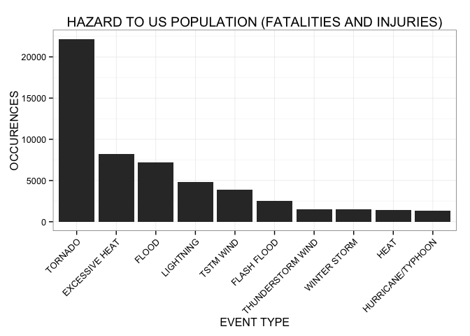
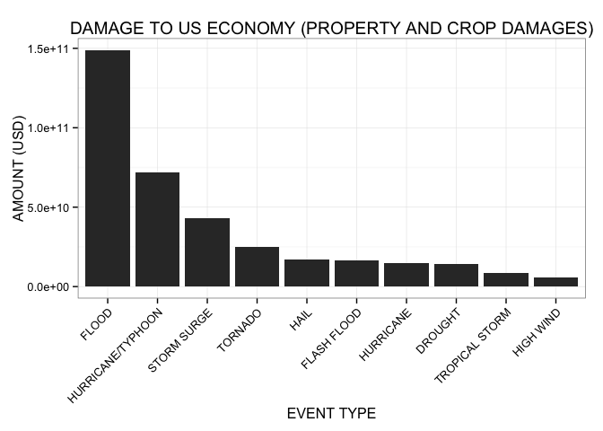

# Reproducible Research: Peer Assessment 2 - NOAA Storm Events Data Analysis

## Synopsis

In the following report, we present an analysis of the [NOAA Storm Events Database](https://www.ncdc.noaa.gov/stormevents/). The raw data consist of 902,297 severe weather events recorded from 1950 to 2011 in the United States. The goal of this analysis is to assess the negative impact of severe weather events on the US population and economy. Namely, we attempt to answer the following questions:

- Which types of severe weather events are the most hazardous to the US population?
- Which types of severe weather events are the most damaging to the US economy?

By aggregating the records by event type, we generate summary tables and the corresponding barcharts for the top 10 types of severe weather events with the most negative impact on the US population (fatalities and injuries) and economy (property and crop damages). In conclusion, tornadoes are the most hazardous to the US population and floods are the most damaging to the US economy.

## Data processing

First, we load the required packages and set some global options.


```r
library(dplyr)
library(magrittr)
library(stringr)
library(lubridate)
library(ggplot2)

options(scipen = 1, digits = 2)
```

Second, we read the data into a dataframe from the [gzipped csv file](https://d396qusza40orc.cloudfront.net/repdata%2Fdata%2FStormData.csv.bz2) containing the NOAA Storm Events Database.


```r
data = read.csv(bzfile("repdata-data-StormData.csv.bz2"))
data = tbl_df(data)
```

Then, we tidy the data by selecting, for each recorded severe weather event, only the variables needed for this analysis:

- EVTYPE = type of severe weather event
- BGN_DATE = beginning date of severe weather event
- FATALITIES = number of fatalities caused by the severe weather event
- INJURIES = number of injuries caused by the severe weather event
- PROPDMG = scientific notation coefficient of the property damage value caused by the severe weather event
- PROPDMGEXP = scientific notation exponent of the property damage value caused by the severe weather event
- CROPDMG = scientific notation coefficient of the crop damage value caused by the severe weather event
- CROPDMGEXP = scientific notation exponent of the crop damage value caused by the severe weather event

In addition, we transform the BGN_DATE variable to only include the year of the severe weather event and we strip+uppercase the EVTYPE variable to correct for the most obvious data entry mistakes (n.b., there are several more data entry mistakes in this field that would need manual correction, but that is beyond the scope of this analysis).


```r
tdata = data %>%
  select(EVTYPE, BGN_DATE, FATALITIES, INJURIES, PROPDMG, PROPDMGEXP, CROPDMG, CROPDMGEXP) %>%
  mutate(EVTYPE = as.factor(toupper(str_trim(EVTYPE))), BGN_DATE = year(mdy_hms(BGN_DATE)))
```

To further tidy the data, we only include severe weather events recorded after 1995 because all 48 standardized event types were recorded as defined in NWS Directive 10-1605 only from 1996 to present (click [here](http://www.ncdc.noaa.gov/stormevents/details.jsp) for more information)). This minimizes the bias due to limited data being collect in previous years and the effect of inflation on the cost of the damage due to the events.


```r
tdata %<>% filter(BGN_DATE > 1995)
```

To further tidy the data, we generate a new PROPDMGAMNT variable (from the PROPDMG and PROPDMGEXP variables) which contains the property damage amount (USD) in standard notation (as opposed to the original scientific notation).


```r
unique(tdata$PROPDMGEXP)
```

```
## [1] K   M B 0
## Levels:  - ? + 0 1 2 3 4 5 6 7 8 B h H K m M
```

```r
tdata$PROPDMGMULT[tdata$PROPDMGEXP == "K"] = 1000
tdata$PROPDMGMULT[tdata$PROPDMGEXP == "M"] = 1e+06
tdata$PROPDMGMULT[tdata$PROPDMGEXP == ""] = 1
tdata$PROPDMGMULT[tdata$PROPDMGEXP == "B"] = 1e+09
tdata$PROPDMGMULT[tdata$PROPDMGEXP == "0"] = 1

tdata %<>% mutate (PROPDMGAMNT = PROPDMG * PROPDMGMULT)
```

To further tidy the data, we generate a new CROPDMGAMNT variable (from the CROPDMG and CROPDMGEXP variables) which contains the crop damage amount (USD) in standard notation (as opposed to the original scientific notation).


```r
unique(tdata$CROPDMGEXP)
```

```
## [1] K   M B
## Levels:  ? 0 2 B k K m M
```

```r
tdata$CROPDMGMULT[tdata$CROPDMGEXP == "K"] = 1000
tdata$CROPDMGMULT[tdata$CROPDMGEXP == "M"] = 1e+06
tdata$CROPDMGMULT[tdata$CROPDMGEXP == ""] = 1
tdata$CROPDMGMULT[tdata$CROPDMGEXP == "B"] = 1e+09
tdata$CROPDMGMULT[tdata$CROPDMGEXP == "0"] = 1

tdata %<>% mutate (CROPDMGAMNT = CROPDMG * CROPDMGMULT)
```

Here is how the data look like after tidying them up.


```r
str(tdata)
```

```
## Classes 'tbl_df', 'tbl' and 'data.frame':	653530 obs. of  12 variables:
##  $ EVTYPE     : Factor w/ 890 levels "?","ABNORMAL WARMTH",..: 880 750 771 771 771 204 312 771 771 771 ...
##  $ BGN_DATE   : num  1996 1996 1996 1996 1996 ...
##  $ FATALITIES : num  0 0 0 0 0 0 0 0 0 0 ...
##  $ INJURIES   : num  0 0 0 0 0 0 0 0 0 0 ...
##  $ PROPDMG    : num  380 100 3 5 2 0 400 12 8 12 ...
##  $ PROPDMGEXP : Factor w/ 19 levels "","-","?","+",..: 17 17 17 17 17 1 17 17 17 17 ...
##  $ CROPDMG    : num  38 0 0 0 0 0 0 0 0 0 ...
##  $ CROPDMGEXP : Factor w/ 9 levels "","?","0","2",..: 7 1 1 1 1 1 1 1 1 1 ...
##  $ PROPDMGMULT: num  1000 1000 1000 1000 1000 1 1000 1000 1000 1000 ...
##  $ PROPDMGAMNT: num  380000 100000 3000 5000 2000 0 400000 12000 8000 12000 ...
##  $ CROPDMGMULT: num  1000 1 1 1 1 1 1 1 1 1 ...
##  $ CROPDMGAMNT: num  38000 0 0 0 0 0 0 0 0 0 ...
```

## Results

Finally, we summarise the data by event type and report the sum of fatalities and injuries as an overall measure of hazard to the US population, as well as the sum of property and crop damages as an overall measure of damage to the US economy (in USD).


```r
tdata.summary = tdata %>%
  group_by(EVTYPE) %>%
  summarise(FATALITIES_AND_INJURIES = sum(FATALITIES) + sum(INJURIES),
            PROP_AND_CROP_DAMAGES = sum(PROPDMGAMNT) + sum(CROPDMGAMNT))
```

### Top 10 types of severe weather events most hazardous to the US population


```r
tdata.summary.fatalities_and_injuries = tdata.summary %>%
  arrange(desc(FATALITIES_AND_INJURIES)) %>%
  select(EVTYPE, FATALITIES_AND_INJURIES) %>%
  print
```

```
## Source: local data frame [430 x 2]
## 
##               EVTYPE FATALITIES_AND_INJURIES
## 1            TORNADO                   22178
## 2     EXCESSIVE HEAT                    8188
## 3              FLOOD                    7172
## 4          LIGHTNING                    4792
## 5          TSTM WIND                    3870
## 6        FLASH FLOOD                    2561
## 7  THUNDERSTORM WIND                    1530
## 8       WINTER STORM                    1483
## 9               HEAT                    1459
## 10 HURRICANE/TYPHOON                    1339
## ..               ...                     ...
```

```r
ggplot(data = tdata.summary.fatalities_and_injuries[1:10,], aes(x = reorder(EVTYPE, -FATALITIES_AND_INJURIES), y = FATALITIES_AND_INJURIES)) +
  geom_bar(stat = "identity") +
  ggtitle("HAZARD TO US POPULATION (FATALITIES AND INJURIES)") +
  xlab("EVENT TYPE") +
  ylab("OCCURENCES") +
  theme_bw() +
  theme(axis.text.x = element_text(angle=45, hjust=1))
```

 

### Top 10 types of severe weather events most damaging to the US economy


```r
tdata.summary.prop_and_crop_damages = tdata.summary %>%
  arrange(desc(PROP_AND_CROP_DAMAGES)) %>%
  select(EVTYPE, PROP_AND_CROP_DAMAGES) %>%
  print
```

```
## Source: local data frame [430 x 2]
## 
##               EVTYPE PROP_AND_CROP_DAMAGES
## 1              FLOOD               1.5e+11
## 2  HURRICANE/TYPHOON               7.2e+10
## 3        STORM SURGE               4.3e+10
## 4            TORNADO               2.5e+10
## 5               HAIL               1.7e+10
## 6        FLASH FLOOD               1.7e+10
## 7          HURRICANE               1.5e+10
## 8            DROUGHT               1.4e+10
## 9     TROPICAL STORM               8.3e+09
## 10         HIGH WIND               5.9e+09
## ..               ...                   ...
```

```r
ggplot(data = tdata.summary.prop_and_crop_damages[1:10,], aes(x = reorder(EVTYPE, -PROP_AND_CROP_DAMAGES), y = PROP_AND_CROP_DAMAGES)) +
  geom_bar(stat = "identity") +
  ggtitle("DAMAGE TO US ECONOMY (PROPERTY AND CROP DAMAGES)") +
  xlab("EVENT TYPE") +
  ylab("AMOUNT (USD)") +
  theme_bw() +
  theme(axis.text.x = element_text(angle=45, hjust=1))
```

 

## Compute environment


```r
sessionInfo()
```

```
## R version 3.1.3 (2015-03-09)
## Platform: x86_64-apple-darwin13.4.0 (64-bit)
## Running under: OS X 10.10.2 (Yosemite)
## 
## locale:
## [1] en_US.UTF-8/en_US.UTF-8/en_US.UTF-8/C/en_US.UTF-8/en_US.UTF-8
## 
## attached base packages:
## [1] stats     graphics  grDevices utils     datasets  methods   base     
## 
## other attached packages:
## [1] ggplot2_1.0.0   lubridate_1.3.3 stringr_0.6.2   magrittr_1.5   
## [5] dplyr_0.4.1    
## 
## loaded via a namespace (and not attached):
##  [1] assertthat_0.1   colorspace_1.2-5 DBI_0.3.1        digest_0.6.8    
##  [5] evaluate_0.5.5   formatR_1.0      grid_3.1.3       gtable_0.1.2    
##  [9] htmltools_0.2.6  knitr_1.9        labeling_0.3     lazyeval_0.1.10 
## [13] MASS_7.3-39      memoise_0.2.1    munsell_0.4.2    parallel_3.1.3  
## [17] plyr_1.8.1       proto_0.3-10     Rcpp_0.11.5      reshape2_1.4.1  
## [21] rmarkdown_0.5.1  scales_0.2.4     tcltk_3.1.3      tools_3.1.3     
## [25] yaml_2.1.13
```
