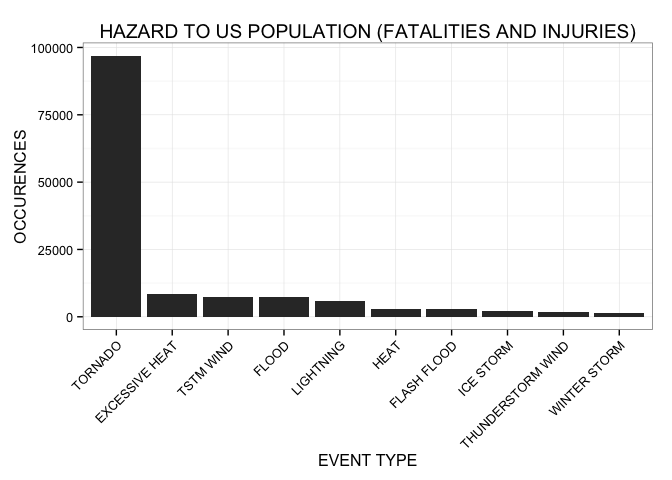
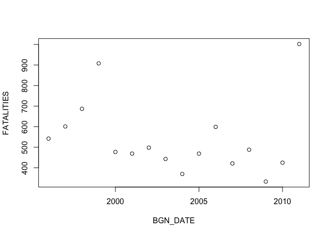

# Reproducible Research: Peer Assessment 2 - NOAA Storm Events Data Analysis

## Synopsis

In the following report, we present an analysis of the [NOAA Storm Events Database](https://www.ncdc.noaa.gov/stormevents/). The raw data consist of 902,297 severe weather events recorded from 1950 to 2011 in the United States. The goal of this analysis is to assess the negative impact of severe weather events on the US population and economy. Namely, we attempt to answer the following questions:

- Which types of severe weather events are the most hazardous to the US population?
- Which types of severe weather events are the most damaging to the US economy?

By aggregating the records by event type, we generate summary tables and the corresponding barcharts for the top 10 types of severe weather events with the most negative impact on the US population (fatalities and injuries) and economy (property and crop damages). Overall, tornadoes are the most hazardous to the US population (with 96,979 fatalities and injuries). On the other hand, floods are the most damaging to the US economy (with $150B of property and crop damages).

## Data processing

First, we load the required packages and set some global options.


```r
library(dplyr)
library(magrittr)
library(ggplot2)

options(scipen = 1, digits = 2)
```

Second, we read the data into a dataframe from the [gzipped csv file](https://d396qusza40orc.cloudfront.net/repdata%2Fdata%2FStormData.csv.bz2) containing the NOAA Storm Events Database.


```r
data = read.csv(bzfile("repdata-data-StormData.csv.bz2"))
data = tbl_df(data)
```

Then, we tidy the data by selecting, for each recorded severe weather event, only the variables needed for our analysis:

- EVTYPE = type of severe weather event
- FATALITIES = number of fatalities caused by the severe weather event
- INJURIES = number of injuries caused by the severe weather event
- PROPDMG = scientific notation coefficient of the property damage value caused by the severe weather event
- PROPDMGEXP = scientific notation exponent of the property damage value caused by the severe weather event
- CROPDMG = scientific notation coefficient of the crop damage value caused by the severe weather event
- CROPDMGEXP = scientific notation exponent of the crop damage value caused by the severe weather event


```r
tdata = data %>%
  select(EVTYPE, FATALITIES, INJURIES, PROPDMG, PROPDMGEXP, CROPDMG, CROPDMGEXP) %>%
  mutate(EVTYPE = toupper(EVTYPE)) %>%
  print
```

```
## Source: local data frame [902,297 x 7]
## 
##     EVTYPE FATALITIES INJURIES PROPDMG PROPDMGEXP CROPDMG CROPDMGEXP
## 1  TORNADO          0       15    25.0          K       0           
## 2  TORNADO          0        0     2.5          K       0           
## 3  TORNADO          0        2    25.0          K       0           
## 4  TORNADO          0        2     2.5          K       0           
## 5  TORNADO          0        2     2.5          K       0           
## 6  TORNADO          0        6     2.5          K       0           
## 7  TORNADO          0        1     2.5          K       0           
## 8  TORNADO          0        0     2.5          K       0           
## 9  TORNADO          1       14    25.0          K       0           
## 10 TORNADO          0        0    25.0          K       0           
## ..     ...        ...      ...     ...        ...     ...        ...
```

To further tidy the data, we generate a new PROPDMGVAL variable (from the PROPDMG and PROPDMGEXP variables) which contains the property damage value in standard notation (as opposed to the original scientific notation).


```r
unique(tdata$PROPDMGEXP)
```

```
##  [1] K M   B m + 0 5 6 ? 4 2 3 h 7 H - 1 8
## Levels:  - ? + 0 1 2 3 4 5 6 7 8 B h H K m M
```

```r
tdata$PROPDMGCONV[tdata$PROPDMGEXP == "K"] = 1000
tdata$PROPDMGCONV[tdata$PROPDMGEXP == "M"] = 1e+06
tdata$PROPDMGCONV[tdata$PROPDMGEXP == ""] = 1
tdata$PROPDMGCONV[tdata$PROPDMGEXP == "B"] = 1e+09
tdata$PROPDMGCONV[tdata$PROPDMGEXP == "m"] = 1e+06
tdata$PROPDMGCONV[tdata$PROPDMGEXP == "0"] = 1
tdata$PROPDMGCONV[tdata$PROPDMGEXP == "5"] = 1e+05
tdata$PROPDMGCONV[tdata$PROPDMGEXP == "6"] = 1e+06
tdata$PROPDMGCONV[tdata$PROPDMGEXP == "4"] = 10000
tdata$PROPDMGCONV[tdata$PROPDMGEXP == "2"] = 100
tdata$PROPDMGCONV[tdata$PROPDMGEXP == "3"] = 1000
tdata$PROPDMGCONV[tdata$PROPDMGEXP == "h"] = 100
tdata$PROPDMGCONV[tdata$PROPDMGEXP == "7"] = 1e+07
tdata$PROPDMGCONV[tdata$PROPDMGEXP == "H"] = 100
tdata$PROPDMGCONV[tdata$PROPDMGEXP == "1"] = 10
tdata$PROPDMGCONV[tdata$PROPDMGEXP == "8"] = 1e+08
tdata$PROPDMGCONV[tdata$PROPDMGEXP == "+"] = 0
tdata$PROPDMGCONV[tdata$PROPDMGEXP == "-"] = 0
tdata$PROPDMGCONV[tdata$PROPDMGEXP == "?"] = 0

tdata %<>% mutate (PROPDMGVAL = PROPDMG * PROPDMGCONV)
```

To further tidy the data, we generate a new CROPDMGVAL variable (from the CROPDMG and CROPDMGEXP variables) which contains the crop damage value in standard notation (as opposed to the original scientific notation).


```r
unique(tdata$CROPDMGEXP)
```

```
## [1]   M K m B ? 0 k 2
## Levels:  ? 0 2 B k K m M
```

```r
tdata$CROPDMGCONV[tdata$CROPDMGEXP == "M"] = 1e+06
tdata$CROPDMGCONV[tdata$CROPDMGEXP == "K"] = 1000
tdata$CROPDMGCONV[tdata$CROPDMGEXP == "m"] = 1e+06
tdata$CROPDMGCONV[tdata$CROPDMGEXP == "B"] = 1e+09
tdata$CROPDMGCONV[tdata$CROPDMGEXP == "0"] = 1
tdata$CROPDMGCONV[tdata$CROPDMGEXP == "k"] = 1000
tdata$CROPDMGCONV[tdata$CROPDMGEXP == "2"] = 100
tdata$CROPDMGCONV[tdata$CROPDMGEXP == ""] = 1
tdata$CROPDMGCONV[tdata$CROPDMGEXP == "?"] = 0

tdata %<>% mutate (CROPDMGVAL = CROPDMG * CROPDMGCONV)
```

## Results

Finally, we summarise the data by event type and report the sum of fatalities and injuries as an overall measure of hazard to the US population, as well as the sum of property and crop damages as an overall measure of damage to the US economy (in USD).


```r
tdata.summary = tdata %>%
  group_by(EVTYPE) %>%
  summarise(FATALITIES_AND_INJURIES = sum(FATALITIES) + sum(INJURIES),
            PROP_AND_CROP_DAMAGES = sum(PROPDMGVAL) + sum(CROPDMGVAL))
```

### Top 10 types of severe weather events most hazardous to the US population


```r
tdata.summary.fatalities_and_injuries = tdata.summary %>%
  arrange(desc(FATALITIES_AND_INJURIES)) %>%
  select(EVTYPE, FATALITIES_AND_INJURIES) %>%
  print
```

```
## Source: local data frame [898 x 2]
## 
##               EVTYPE FATALITIES_AND_INJURIES
## 1            TORNADO                   96979
## 2     EXCESSIVE HEAT                    8428
## 3          TSTM WIND                    7461
## 4              FLOOD                    7259
## 5          LIGHTNING                    6046
## 6               HEAT                    3037
## 7        FLASH FLOOD                    2755
## 8          ICE STORM                    2064
## 9  THUNDERSTORM WIND                    1621
## 10      WINTER STORM                    1527
## ..               ...                     ...
```

```r
ggplot(data = tdata.summary.fatalities_and_injuries[1:10,], aes(x = reorder(EVTYPE, -FATALITIES_AND_INJURIES), y = FATALITIES_AND_INJURIES)) +
  geom_bar(stat = "identity") +
  ggtitle("HAZARD TO US POPULATION (FATALITIES AND INJURIES)") +
  xlab("EVENT TYPE") +
  ylab("OCCURENCES") +
  theme_bw() +
  theme(axis.text.x = element_text(angle=45, hjust=1))
```

 

### Top 10 types of severe weather events most damaging to the US economy


```r
tdata.summary.prop_and_crop_damages = tdata.summary %>%
  arrange(desc(PROP_AND_CROP_DAMAGES)) %>%
  select(EVTYPE, PROP_AND_CROP_DAMAGES) %>%
  print
```

```
## Source: local data frame [898 x 2]
## 
##               EVTYPE PROP_AND_CROP_DAMAGES
## 1              FLOOD               1.5e+11
## 2  HURRICANE/TYPHOON               7.2e+10
## 3            TORNADO               5.7e+10
## 4        STORM SURGE               4.3e+10
## 5               HAIL               1.9e+10
## 6        FLASH FLOOD               1.8e+10
## 7            DROUGHT               1.5e+10
## 8          HURRICANE               1.5e+10
## 9        RIVER FLOOD               1.0e+10
## 10         ICE STORM               9.0e+09
## ..               ...                   ...
```

```r
ggplot(data = tdata.summary.prop_and_crop_damages[1:10,], aes(x = reorder(EVTYPE, -PROP_AND_CROP_DAMAGES), y = PROP_AND_CROP_DAMAGES)) +
  geom_bar(stat = "identity") +
  ggtitle("DAMAGE TO US ECONOMY (PROPERTY AND CROP DAMAGES)") +
  xlab("EVENT TYPE") +
  ylab("AMOUNT (USD)") +
  theme_bw() +
  theme(axis.text.x = element_text(angle=45, hjust=1))
```

 

## Compute environment


```r
sessionInfo()
```

```
## R version 3.1.3 (2015-03-09)
## Platform: x86_64-apple-darwin13.4.0 (64-bit)
## Running under: OS X 10.10.2 (Yosemite)
## 
## locale:
## [1] en_US.UTF-8/en_US.UTF-8/en_US.UTF-8/C/en_US.UTF-8/en_US.UTF-8
## 
## attached base packages:
## [1] stats     graphics  grDevices utils     datasets  methods   base     
## 
## other attached packages:
## [1] ggplot2_1.0.0 magrittr_1.5  dplyr_0.4.1  
## 
## loaded via a namespace (and not attached):
##  [1] assertthat_0.1   colorspace_1.2-5 DBI_0.3.1        digest_0.6.8    
##  [5] evaluate_0.5.5   formatR_1.0      grid_3.1.3       gtable_0.1.2    
##  [9] htmltools_0.2.6  knitr_1.9        labeling_0.3     lazyeval_0.1.10 
## [13] MASS_7.3-39      munsell_0.4.2    parallel_3.1.3   plyr_1.8.1      
## [17] proto_0.3-10     Rcpp_0.11.5      reshape2_1.4.1   rmarkdown_0.5.1 
## [21] scales_0.2.4     stringr_0.6.2    tcltk_3.1.3      tools_3.1.3     
## [25] yaml_2.1.13
```
